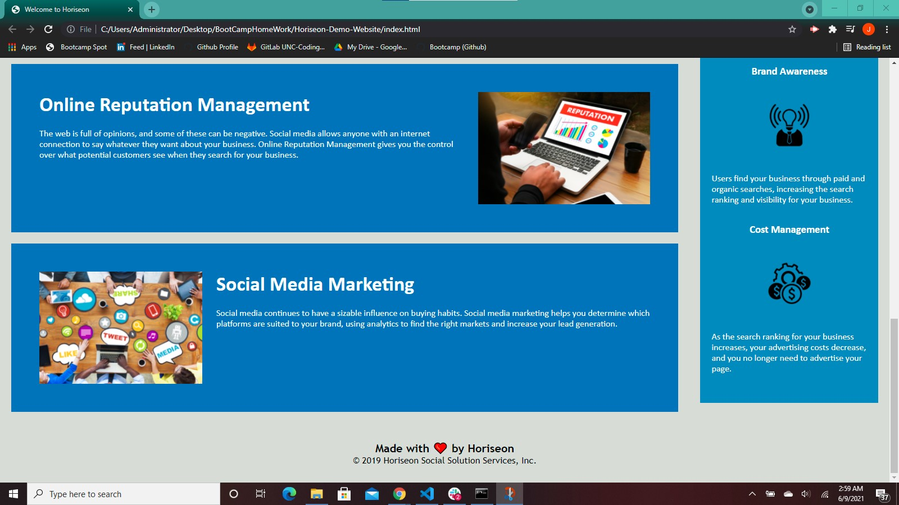

# Horiseon-Demo-Website

This is a demo website for Horiseon, a social solution service company. 
I was tasked with refactorying their html and css code for their home page.
As a marketing company they want html code that follows accessibility standards 
because it's critical that their site is optimized for search engines.
The html and css document conatins comments to identify what was refactored.

## Screen shots

## Website

Here is a link to the [website](https://concreteroc.github.io/Horiseon-Demo-Website/)